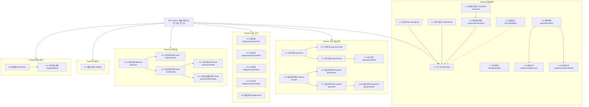

# 화면 구조 — draw.io Mermaid (1회 복붙용)

> 원본: [money-log-화면구성.drawio](money-log-화면구조.drawio)  
> **Insert → Advanced → Mermaid** — 아래 코드만 한 번에 붙여넣기

```mermaid
flowchart TB
  root["루트 redirect 월별가계부 미로그인시 로그인"]

  subgraph P1[Phase1 회원인증]
    S11["1.1 로그인 /auth/login"]
    S12["1.2 회원가입 /auth/signup"]
    S13["1.3 아이디찾기 /auth/find-id"]
    S14["1.4 비밀번호찾기 /auth/find-password"]
    S15["1.5 비밀번호변경 /auth/reset-password"]
    S16["1.6 권한없음 /error/forbidden"]
    S17["1.7 본인정보 /member/profile"]
    S18["1.8 회원목록 /admin/members"]
    S19["1.9 회원추가 /admin/members/new"]
    S110["1.10 회원수정 /admin/members/id/edit"]
  end

  subgraph P2[Phase2 수단 지출유형]
    S21["2.1 수단목록 /payments"]
    S22["2.2 수단등록 /payments/new"]
    S23["2.3 수단상세 /payments/id"]
    S24["2.4 수단수정 /payments/id/edit"]
    S25["2.5 지출유형목록 /expend-groups"]
    S26["2.6 지출유형등록 /expend-groups/new"]
    S27["2.7 지출유형상세 /expend-groups/id"]
    S28["2.8 지출유형수정 /expend-groups/id/edit"]
  end

  subgraph P3[Phase3 지출 소득]
    S31["3.1 지출등록 /ledger/expenses/new"]
    S32["3.2 지출수정 /ledger/expenses/id/edit"]
    S33["3.3 소득등록 /ledger/incomes/new"]
    S34["3.4 소득수정 /ledger/incomes/id/edit"]
    S35["3.5 엑셀등록 /ledger/excel"]
  end

  subgraph P4[Phase4 고정지출]
    S42["4.2 고정지출목록 /fixed-expenses"]
    S43["4.3 고정지출등록 /fixed-expenses/new"]
    S44["4.4 고정지출상세 /fixed-expenses/id"]
    S45["4.5 고정지출수정 /fixed-expenses/id/edit"]
    S46["4.6 고정지출월별수정 /fixed-expenses/id/monthly"]
  end

  subgraph P5[Phase5 가계부]
    S51["5.1 월별가계부 /ledger"]
  end

  subgraph P6[Phase6 목표 통계]
    S61["6.1 기본목표금액 /targets/default"]
    S62["6.2 월별통계 /statistics"]
  end

  root --> S11
  root --> P2
  root --> P3
  root --> P4
  root --> P5
  root --> P6

  S12 --> S11
  S13 --> S11
  S14 --> S15
  S15 --> S11
  S16 -.-> S11
  S18 --> S19
  S18 --> S110

  S21 --> S22
  S21 --> S23
  S23 --> S24
  S25 --> S26
  S25 --> S27
  S27 --> S28

  S42 --> S43
  S42 --> S44
  S44 --> S45
  S44 --> S46

  S62 --> S61
```
